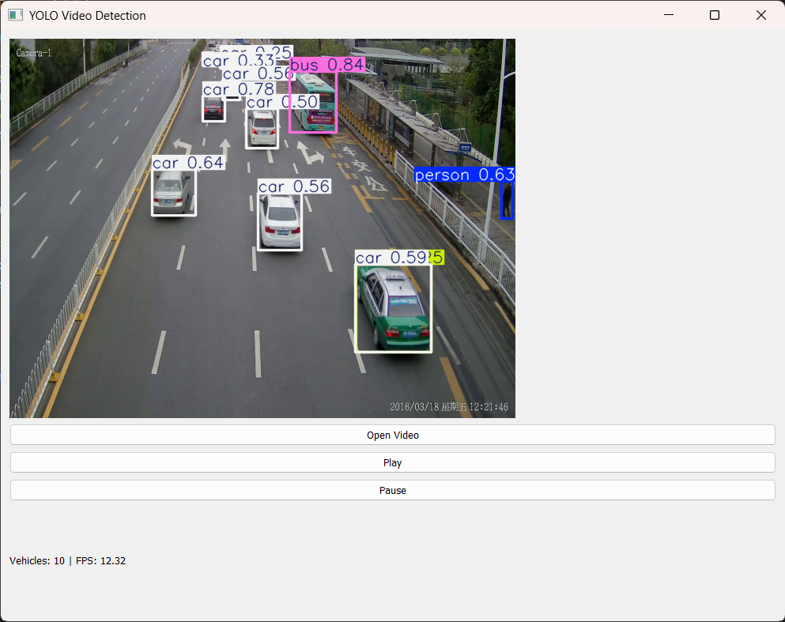

# 🚗 YOLO Video Detection App


A desktop application built using PyQt5 that performs real-time object detection on video files using YOLOv8.

---

## 📸 Demo



---

## ✨ Features

* 📂 Load and play video files
* 🎯 Real-time object detection using YOLOv8
* 🏷️ Bounding boxes with labels
* 🚗 Vehicle-focused detection (cars, buses, trucks, motorcycles)
* 📊 Live FPS and object count display
* 🖥️ Clean desktop GUI using PyQt5

---

## 🧠 Tech Stack

* Python 3.10
* PyQt5 (GUI)
* OpenCV (Video Processing)
* YOLOv8 (Ultralytics)

---

## ⚙️ Installation

```bash
git clone https://github.com/your-username/yolo-video-detection-app.git
cd yolo-video-detection-app

python -m venv venv
venv\Scripts\activate   # Windows

pip install -r requirements.txt
```

---

## ▶️ Usage

```bash
python main.py
```

1. Click **Load Video**
2. Select a video file
3. Click **Play**
4. View real-time detections

---

## 📁 Project Structure

```
yolo-video-detection-app/
│
├── main.py
├── detector.py
├── requirements.txt
├── README.md
├── .gitignore
└── assets/
    └── demo.png
```

---

## 🚀 Future Improvements

* 🔄 Real-time webcam detection
* 🧠 Object tracking (SORT)
* 📈 Vehicle counting system
* 📊 Dashboard-style UI

---

## 📌 Author

* Govind Sankar V G

---


